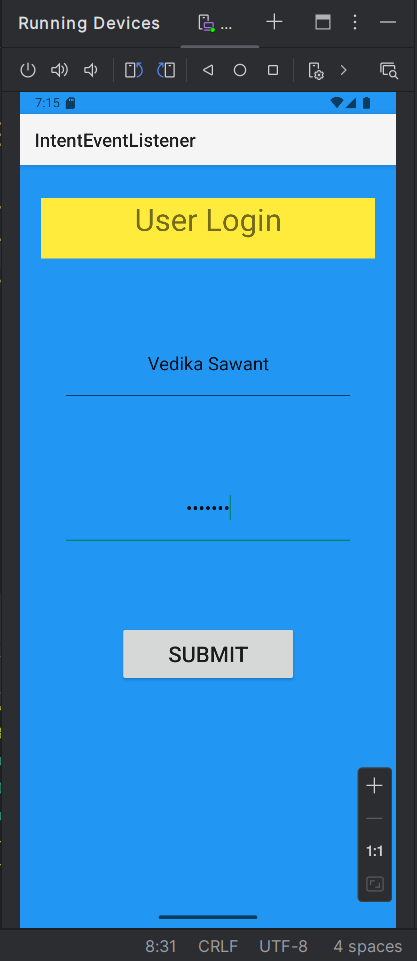
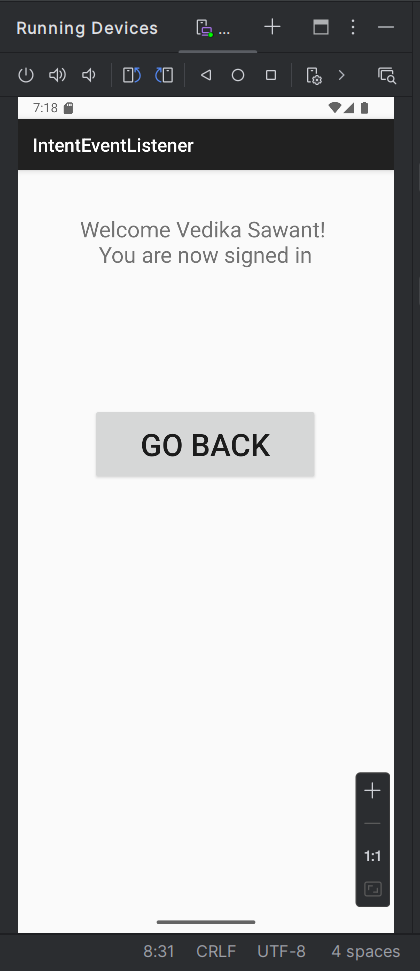

# Kid-Ex-Android-Development-Project
A simple Android Development Project using explicit intent which takes username and password and navigates to the next welcome page using an intent event listener.

## 📌 Project Overview
This is an Android application developed in Java. It includes Java source files, XML layout files, and a pre-built APK for installation.

## 📂 Project Structure
```
/your-project-folder
│-- /src/main/java/com/example/yourapp/  # Java source files
│-- /src/main/res/layout/                # XML layout files
│-- AndroidManifest.xml                   # Android app manifest
│-- build.gradle                           # Gradle build configuration
│-- app.apk                                # Pre-built APK
```

## 🚀 How to Set Up the Project in Android Studio
### 1️⃣ **Install Android Studio**
- Download and install **Android Studio** from the [official website](https://developer.android.com/studio).
- Open Android Studio and set up the **Android SDK** during installation.

### 2️⃣ **Open the Project in Android Studio**
1. Launch **Android Studio**.
2. Click **"Open"** and select your project folder.
3. Wait for **Gradle sync** to complete.

### 3️⃣ **Verify Project Structure**
- Ensure `res/layout/` contains the necessary XML layout files.
- Open `AndroidManifest.xml` and verify that `MainActivity` is properly registered:
  ```xml
  <activity android:name=".MainActivity">
      <intent-filter>
          <action android:name="android.intent.action.MAIN" />
          <category android:name="android.intent.category.LAUNCHER" />
      </intent-filter>
  </activity>
  ```

### 4️⃣ **Run the Application on an Emulator or Device**
- Click **Run ▶** or press **Shift + F10**.
- Select an emulator or connected Android device.
- If you don't have an emulator, create one using **AVD Manager** (`Tools → Device Manager`).

## 🛠 Alternative: Setting Up the Project in IntelliJ IDEA
- Install **IntelliJ IDEA (Ultimate or Community Edition)**.
- Install the **Android Plugin** (`File → Settings → Plugins → Search "Android" → Install`).
- Configure the **Android SDK** (`File → Project Structure → SDKs → Add → Android SDK`).
- Open the project and allow **Gradle sync** to complete.

## 📱 Installing the APK
- If you just want to install and test the app without running the code:
  1. Copy `app.apk` to your Android device.
  2. Enable **Install Unknown Apps** in your phone settings.
  3. Open the APK file and install the app.

## ❓ Troubleshooting
- **Gradle Sync Errors?** → Try `File → Invalidate Caches & Restart`.
- **Android SDK Not Found?** → Set the SDK path in `File → Project Structure → SDK Location`.
- **App Crashing?** → Check the **Logcat** (`View → Tool Windows → Logcat`).

## 📸 Output

| Login Page | Welcome Page |
|------------|--------------|
|  |  |

